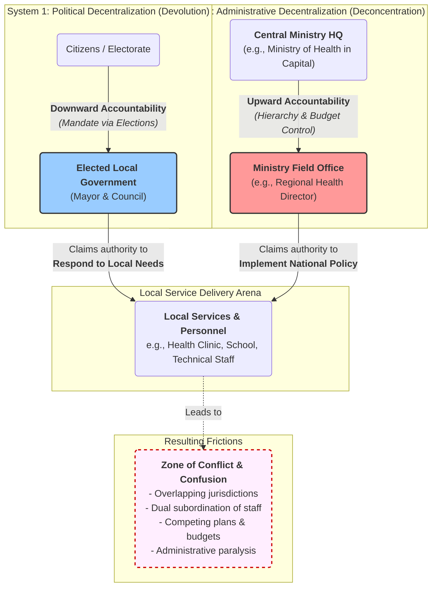

```mermaid
graph TD
    subgraph "System 1: Political Decentralization (Devolution)"
        direction TB
        C(Citizens / Electorate)
        LG("<b>Elected Local Government</b><br>(Mayor & Council)")
        C -- "<b>Downward Accountability</b><br><i>(Mandate via Elections)</i>" --> LG
    end

    subgraph "System 2: Administrative Decentralization (Deconcentration)"
        direction TB
        CHQ("<b>Central Ministry HQ</b><br>(e.g., Ministry of Health in Capital)")
        FO("<b>Ministry Field Office</b><br>(e.g., Regional Health Director)")
        CHQ -- "<b>Upward Accountability</b><br><i>(Hierarchy & Budget Control)</i>" --> FO
    end

    subgraph "Local Service Delivery Arena"
        SA("<b>Local Services & Personnel</b><br>e.g., Health Clinic, School, Technical Staff")
    end

    LG -- "Claims authority to<br><b>Respond to Local Needs</b>" --> SA
    FO -- "Claims authority to<br><b>Implement National Policy</b>" --> SA
    
    subgraph "Resulting Frictions"
        Conflict("<b>Zone of Conflict & Confusion</b><br>- Overlapping jurisdictions<br>- Dual subordination of staff<br>- Competing plans & budgets<br>- Administrative paralysis")
    end

    SA-.->|Leads to| Conflict

    style LG fill:#9cf,stroke:#333,stroke-width:2px
    style FO fill:#f99,stroke:#333,stroke-width:2px
    style Conflict fill:#fef,stroke:#c00,stroke-width:2px,stroke-dasharray: 5 5
```
